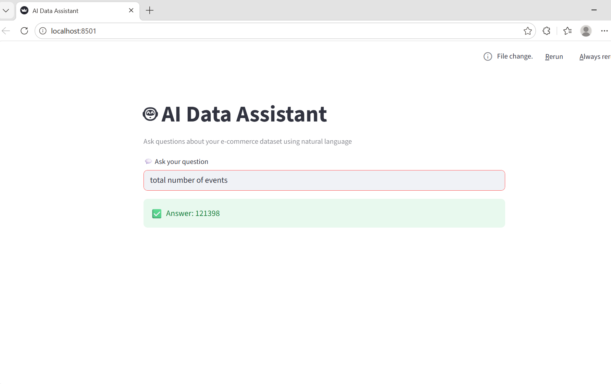

# 🤖 AI Data Assistant

An AI-powered data assistant that converts natural language queries into SQL and retrieves insights from an e-commerce dataset.

---

## 🚀 Features
- Natural language → SQL conversion
- SQLite database integration
- Local LLM using LLaMA3 (via Ollama)
- Interactive Streamlit web interface

---

## 🛠️ Tech Stack
- Python
- LangChain
- Ollama (LLaMA3)
- SQLite
- Streamlit

---

## 📊 Example Queries
- total number of events
- how many purchases are there
- average price
- count events by event type

---

## 📸 Demo



---

## ▶️ Run Locally

### 1. Clone repository
```bash
git clone https://github.com/your-username/ai-data-assistant.git
cd ai-data-assistant

2. Create virtual environment
python -m venv venv
venv\Scripts\activate


3. Install dependencies
pip install -r requirements.txt

4. Run Ollama (LLM)
ollama run llama3

5. Run the app
streamlit run ui.py


Project Overview

This project demonstrates how Large Language Models (LLMs) can be integrated with structured databases to enable natural language querying. Users can ask questions in plain English, which are automatically converted into SQL queries and executed on the dataset.

Key Highlights
Built an end-to-end AI data assistant pipeline
Integrated LLM with SQL database using LangChain
Implemented prompt engineering for accurate SQL generation
Developed an interactive UI using Streamlit


📁 Project Structure
ai-data-assistant/
│
├── app.py
├── ui.py
├── requirements.txt
├── README.md
├── data/
└── screenshot.png


Author
Kanchan